As a seasoned Cloud Operations, Solutions, and Automation Architect, I bring extensive expertise in system design, installation, and optimization to align with strategic business objectives. I have a proven ability to lead teams and manage projects with efficiency, consistently delivering high-quality results within budget and on schedule. My strong technical acumen, coupled with exceptional communication skills, allows me to translate complex requirements into robust, innovative solutions while ensuring seamless implementation across all levels of an organization. I am committed to driving business success through the design and execution of cutting-edge technology solutions that enhance operational efficiency and overall performance.

<!---
mohang6770/mohang6770 is a ✨ special ✨ repository because its `README.md` (this file) appears on your GitHub profile.
You can click the Preview link to take a look at your changes.https://github.com/mohang6770/mohang6770/blob/main/README.md
--->

